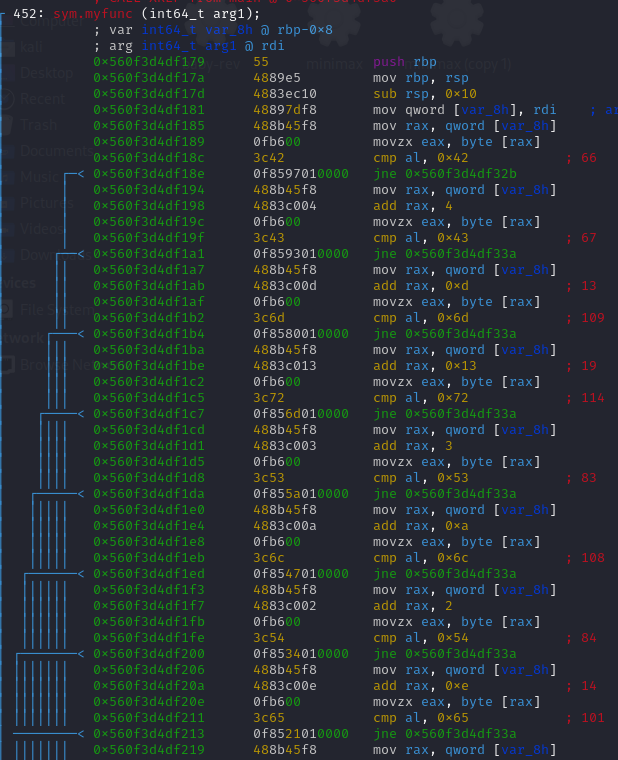

Nous utiliserons Radare2 afin de résoudre ce challenge.
Pour commencer le challenge, nous exécutons le challenge et nous remarquons qu’il s’agit d’un simple mot de passe a retrouver pour obtenir le flag. 

Une fois Radare2 lancer nous remarquons que le main appelle une fonction appelé “myfun”. Cette fonction affiche “YIPEEEE” après un total de 23 comparaisons. Tout cela nous permet de comprendre que cette fonction  sert à savoir si l’utilisateur a entré le bon mot de passe. Comme il y a 23 comparaisons ( les lignes avec “cmp”) le mot de passe fait 23 caractères de long, il suffit de comprendre avec quel caractère se fait chaque comparaison pour retrouver le mot de passe.

Chaque comparaison se fait avec un élément sous la forme de : “0x6c”, c’est simplement un entier en base 16 et l’entier est mis en rouge sur la même ligne. Cet entier correspond à une lettre en ASCII ici 108 est un “l”. Or si nous alignons toutes les lettres avec cette méthode nous trouvons : 

**“B C m r S l T e 0 } { T  I v w c F 3 3 0 t”**

Or cela ne ressemble pas exactement à un flag,il semble que les lettres ne soient pas dans le bon ordre. Avant chaque comparaison il y a un “add”, en fait le mot de passe n’est pas checker dans le bon ordre, ces “add” vont aller comparer des lettres d’une position précise correspondant à la valeur qui la suit. Grâce à cette logique nous pouvons retrouver le flag en mettant les lettres dans le bon ordre.

**Le flag est : BITSCTF{w3lc0me_t0_r3v}**