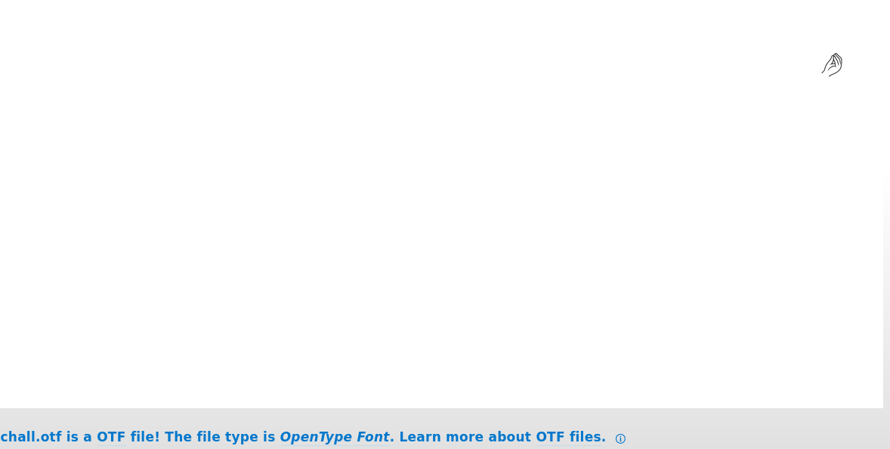

j’ai téléchargé le fichier du challenge:\"chall.otf\"
Je me suis ensuite renseigné sur le format du fichier. C’est un type de fichier qui contient une police d’écriture.
Voici ce qu’on obtient en l’affichant :

Rien de très concluant…

J’ai ensuite cherché des chaines de caractères cachées dans le fichier:

On y trouve un lien vers une video youtube [https://www.youtube.com/watch?v=g6tuepmUmJg](https://www.youtube.com/watch?v=g6tuepmUmJg) et cette suite de nombre allant de s0000 à s2047.
J’ai ensuite téléchargé un logiciel d’édition de police et j’ai ouvert le fichier dedans. On peut y voir notre main et rien pour les autres lettres.

Mais en allant tout en bas du fichier, on retrouve une suite de \"NO\" numéroté de s0000 à s2047.

mais parmis ces \"NO\" il y a un \"YES\" le glyphe s1773.

En regardant les infos du glyph, on trouve une nombre "s1548" qui ainsi qu’un caractère \"}\". Après réflexion, je me rends au glyphe s1548, qui nous donne un "!" ainsi qu'une référence vers un autre glyphe. En continuant ce processus, on reconstitue la chaine de caractère suivante:

}!!3n1hc4m_3ta7s_371n1f_4_3b_n4c_s3rut4g1l_tn0f{galf

qui après avoir été retournée, nous donne le flag:

**flag{f0nt_l1g4tur3s_c4n_b3_4_f1n173_s7at3_m4ch1n3!!}**
