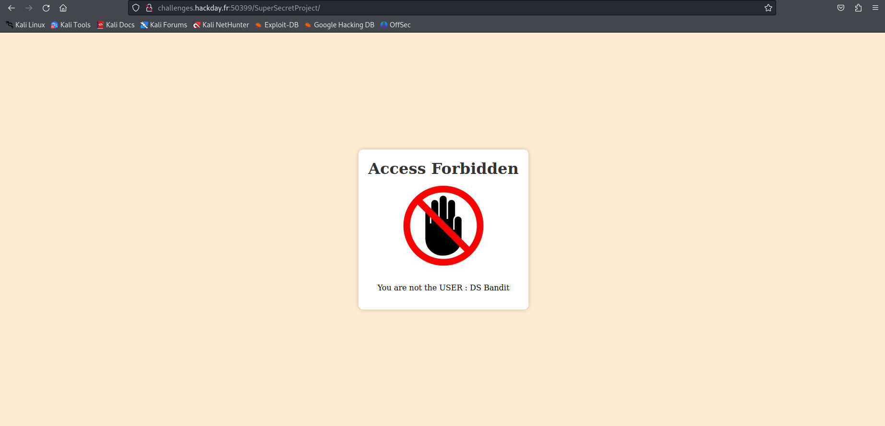
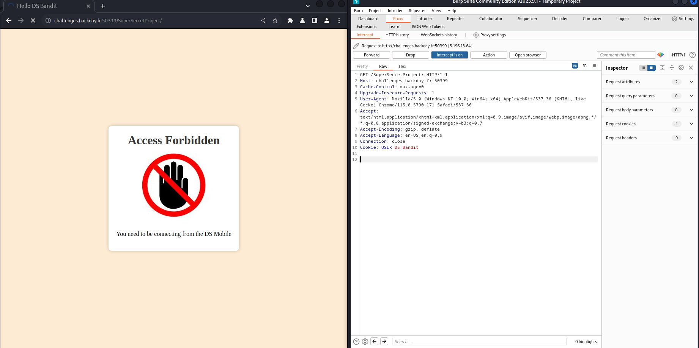
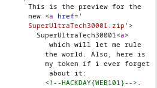

On arrive sur le site, et on peut voir cette page

en regardant le code source, on trouve ce chemin en commentaire

Sur ce chemin, on arrive sur cette page 

Afin de ce faire passer pour Ds Bandit, on ajoute la ligne Cookie: USER=Ds Bandit dans notre requête, grace à BurpSuite

Afin de ce faire passer pour la machine DsMobile, on modifie le user agent en DsMobile, toujours grace à BurpSuite

On obtient ainsi le flag !

