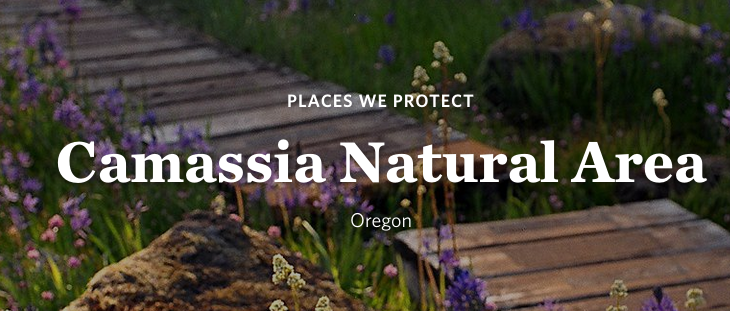

Pour ce challenge nous somme face à une photo appellé flowers.jpg et il nous est demandé de retrouver le lieu ou elle à été prise.

Xweiss et moi avons commencé par faire une recherche par image des fleurs, avec pour objectif de les identifier et d'identifier les zones ou on peut les trouver.

Google lens nous donne une espèce de fleur, *Camassia leichtlinii* que l'on trouve à l'ouest de la chaine de montagne des Cascades, dans le nord-ouest des États-unis. Sachant que le CTF est organisé par l'Oregon State University Security Club, on cherche un lieu dans l'Oregon avec ce type de fleurs.

Une simple recherche internet nous redirige vers le 

on test le flag **dam{camassia-natural-area}** qui est bon!
