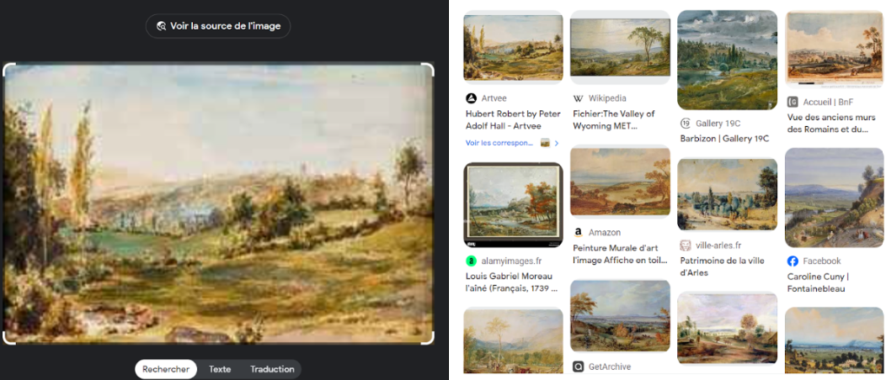
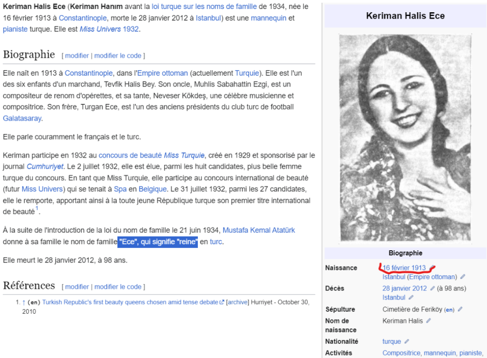

La description du challenge nous apprend que nous cherchons la signification du prénom d’une femme, a ce a partir de la photo d’une peinture.

Içi nous utilisons google lens pour chercher des informations sur la peinture, grâce à cet outil on trouve le nom et l’auteur de la peinture : Peter adolf Hall, nom de peinture, “landscape”.
Suite à des recherches nous retrouvons le site suivant : [nationalmuseum](https://collection.nationalmuseum.se/eMP/eMuseumPlus?service=ExternalInterface&module=collection&objectId=26222&viewType=detailView)

Grâce à ce site nous retrouvons un titre plus précis : “Landscape from Spa”, c’est donc une peinture des alentoure de Spa, nous pouvons également retrouver cette information dans la description

Grâce à l’indice donné par le challenge qui nous donne une date, nous effectuons la recherche suivante sur navigateur : Spa "16 février 1913" (force le 16 février 1913 dans les sites recherchés). Cette recherche nous amène à une page nous parlant d’une femme ayant remporté un concour de beauté dans la ville de Spa : 

Cette femme a pour nom Keirman Halis Ece et dans la page wikipedia nous retrouvons que son nom Ece signifie “reine”, notre flag est donc : 
**BITSCTF{queen}**