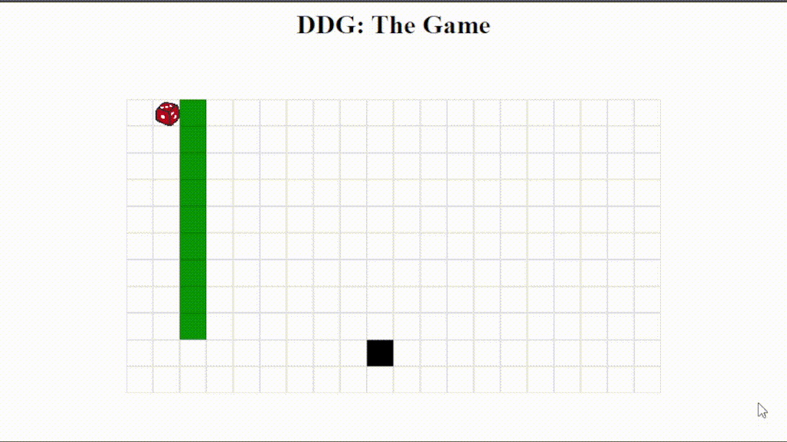

Le challenge se présente de cette manière.
On peut déplacer le dé avec les touches ZQSD et nous devons atteindre le carré noir, qui lui bouge aléatoirement sur une des 4 cases autour de lui à chacun de nos déplacements

en regardant dans le code source, on repère la fonction “win” qui contient le début du flag

on remarque que la fonction prend en paramètre un certain “history”

On remarque que “history” est un tableau contenant les déplacement du dé

on remarque cette fonction, qui modifie history, puis le renvoie

afin de tester son comportement, je l'ai dupliqué en local et lui envoyer en paramètre des déplacements sur le même format que “history”

"encode" nous donne , via un historique de déplacement, une chaine de caractère qui serait mise au bout de l’url de “replay” qui s'affiche quand on "gagne" le jeu,quand on touche la case noire. 

Au vu de l’intitulé du challenge, on sait qu’il faut faire le meilleur score possible , ainsi il suffit de donner l’historique de la meilleure série de coup possible pour gagner, c’est à a dire en 9 coups.

ainsi, on rentre le début du flag obtenu précemment, 

et on le complète avec le résultat obtenu via "encode"

on obtient ainsi le flag ! 

**_{pr0_duck_gam3r_AAEJCQEBCQgCAQkHAwEJBgQBCQUFAQkEBgEJAwcBCQIIAQkB}_**
