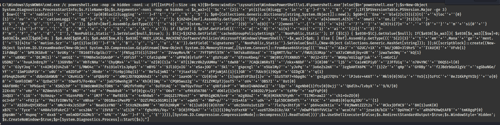

# \/!\\\/!\\\/!\\À FINIR\/!\\\/!\\\/!\\

Ce challenge nous demande d’étudier un maliciel. On télécharge donc le fichier et on regarde quel genre de fichier c’est:

Apparemment c’est une archive de type Uharc. Après quelques recherches, je comprend que c’est un ancien type d’archive windows. Je lance donc une machine virtuelle windows7 et télécharge un logiciel me permetant de lire ce type d’archive:

 

après désarchivage, on obtient ce script powershell:

